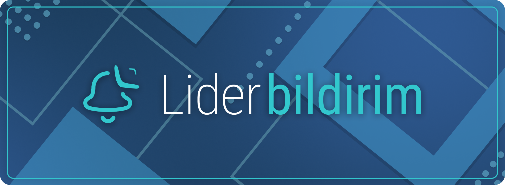
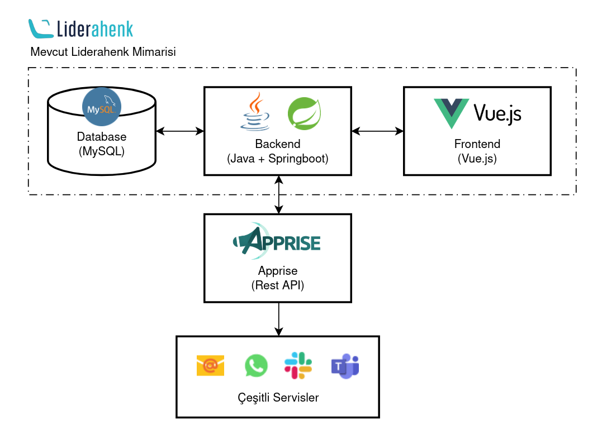

Bu organizasyonda mevcut Lider kod tabanına eklenen **LiderBildirim** (bildirim sistemi) geliştirmeleri bulunmaktadır 

## Amaç

LiderBildirim, yönetim panelinden bildirim kanalları tanımlamayı, bu kanalları tetikleyicilerle ilişkilendirmeyi ve farklı servisler (Email, Mattermost, Telegram, Apprise vb.) üzerinden test/persist etmeyi hedefler.

## Değişiklik Yapılan Repolar

- **Frontend: [liderui](https://github.com/LiderBildirim-org/liderui)**
- **Backend: [liderapi](https://github.com/LiderBildirim-org/liderapi)**
- **Installer: [lider-ahenk-installer](https://github.com/LiderBildirim-org/lider-ahenk-installer)**
- **Dokümantasyon: [lider-ahenk-docs](https://github.com/LiderBildirim-org/lider-ahenk-docs)**

## API Entegrasyonu (AppRise)

- `GET /api/lider/settings/notification-settings`
- `POST /api/lider/settings/update/notification-settings`
- `POST /api/lider/settings/test/notification-service`